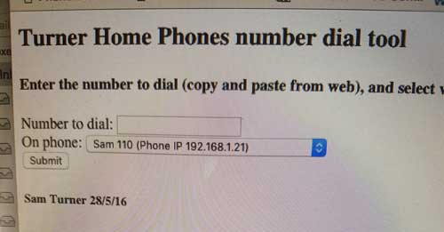
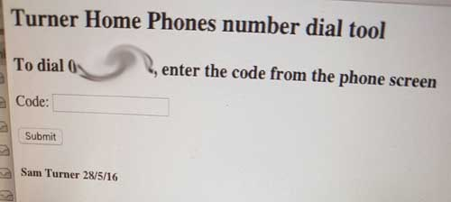
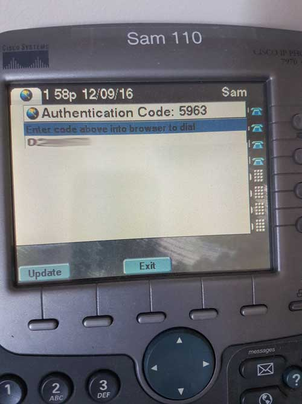
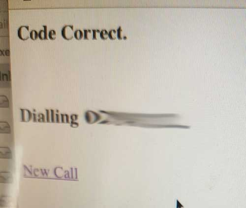
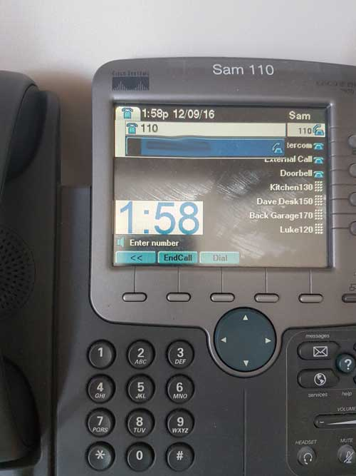

# Cisco-IP-Phone-Dial-from-Web
A tool to dial a number on your Cisco IP Phone from your browser with authentication.

1. webDial.html (IP ADDRESS, NUMBER TO DIAL) => push to dialPushCheck.php

2. dialPushCheck.php creates random code => push code to $ip-code.php file

3. CiscoIPPhoneExecute fetch $ip-code.php file and display on phone screen.

4. Code is entered in browser. IF match, => Send dial command to phone.

